## Table Of Contents
* [Introduction](#introduction)
* [Structure of repository](#structure-of-repository)
* [1. Data Analysis](#data-analysis)
  * [a. Removing an outlier](#removing-an-outlier)
  * [b. Highest turnover in 2016](#highest-turnover-in-2016)
  * [c. Top 5 weeks for department 88 in 2015](#top-5-weeks-for-department-88-in-2015)
  * [d. Top performers stores of 2014](#top-performers-stores-in-2014)
  * [e. What kind of sport is department 73](#what-kind-of-sport-is-department-73)
  * [f. What kind of sport is department 117](#what-kind-of-sport-is-department-117)
  * [g. A representation of business unit features](#a-representation-of-business-unit-features)
  * [h. An overall vue on data](#an-overall-vue-on-data)
* [2. Modeling](#modeling)
  * [a. Firsts models](#firsts-models)
  * [b. Final model](#final-model)
* [3. Datasets](#datasets)
* [5. Training and Results](#results)
  * [KNN](#knn)
  * [LSTM Module](#lstm-module)
* [6. Pipeline](#pipeline)
* [7. Using the pipeline](#using-the-pipeline)
* [8. Improve the model ?](#improve-the-model)

## Introduction

This project aims at developing a machine learning model able to predict from 1 to 8 next weeks turnovers for a given store and department.

The prediction on the test set can be found in file data/results.csv, it is on the same format as train.csv

## Structure of repository

* data folder contains the data used to make a prediction
* dataset folder contains files related to dataset class
* media folder contains all media (pictures) related to the project
* model folder contains the models weights for prediction, the model implementation (curvegen.py is not used in the project for now)
* training contains all the files containing functions used for training
* utils contains files with small but usefull functions
* annual_curve_model_training.ipynb is the file used to train the knn models
* data_analysis.ipynb is the file used for data analysis (and to answer the questions)
* dataset_building.ipynb is the file used for dataset creation
* make_prediction.py is the file used to make prediction on data folded files
* model_evaluation.ipynb is a file used to make some plot and evaluate the model.
* model_training.ipynb is the file used to train the lstm model.
* prediction_visu.ipynb is a file used to check that the pipeline is working properly.

## Data Analysis

All the data analysis made in this part has been done using <a href="data_analysis.ipynb" target="_blank">data_analysis.ipynb</a> notebook.

### Removing an outlier

During the analysis of data, I figured out that in 2013 for department 88 the annual turnover was significantly higher than the other years. I plotted the turnover in function of time in 2013 :

  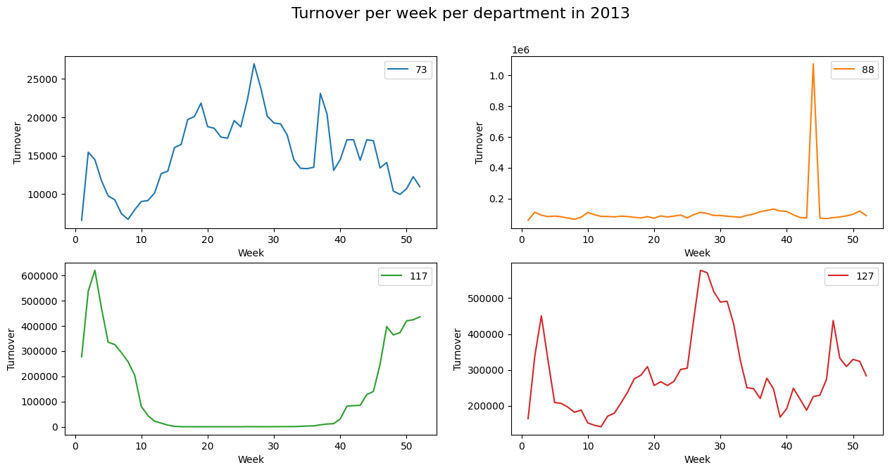

After investigation, I figured out that this raise on week 44 was due to one single business unit (id=30). In my opinion this data might probably be an error, thus I replaced this value by the average value of the turnover of department 88 for business unit id=30 during week 44 in 2014,2015 and 2016.
This is the result of the modification :

  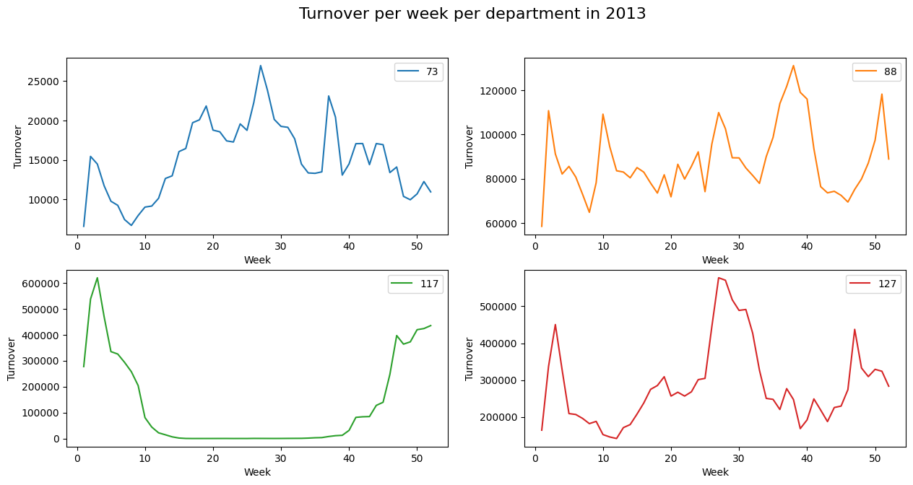

### Highest turnover in 2016

To know what department made the highest turnover in 2016, I chose to plot the annual turnover for each departement for each year(as this is also interesting to analyze the evolution of the annual turnover per department and per year).

  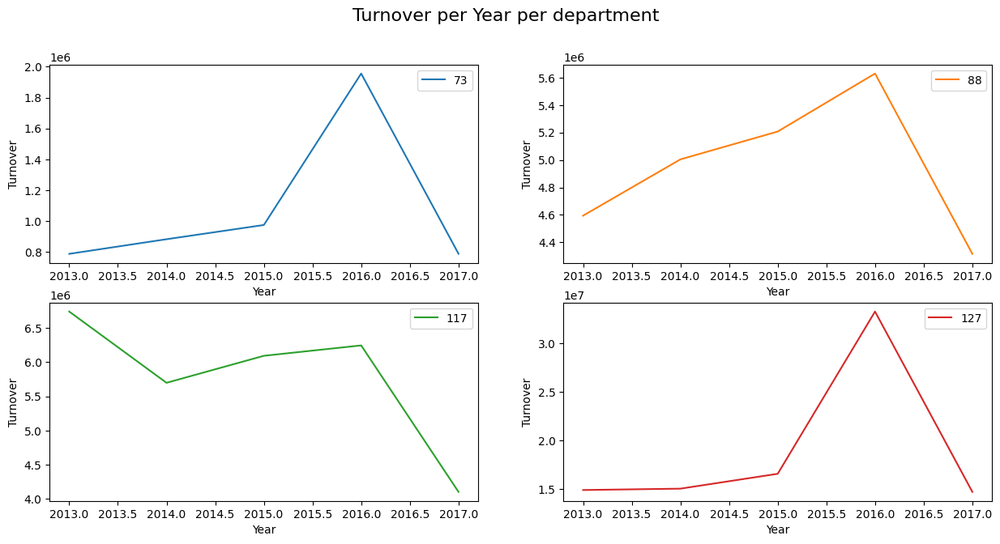

The department that made the highest turnover in 2016 is the department 127 with a turnover of 3.3295e+07.

This figure also shows that the annual turnover is not constant, it can even double within a year (as in 2016) for department 73 and 127.

### Top 5 weeks for department 88 in 2015

I decided to plot the evolution of the turnover on a year per department for every year between 2013 and 2016.

  

  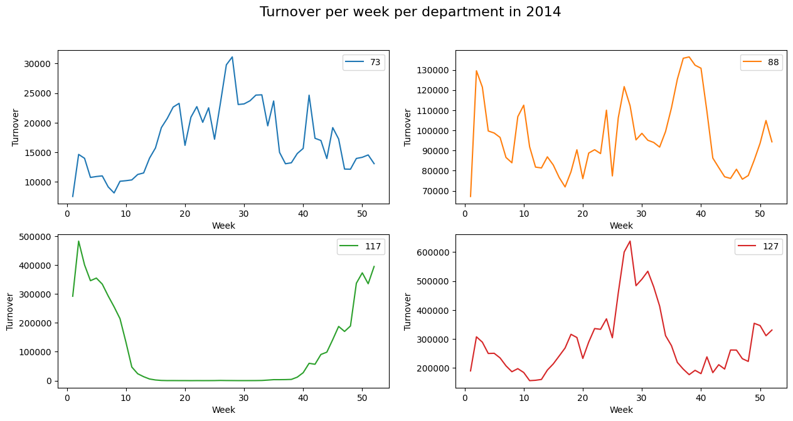

  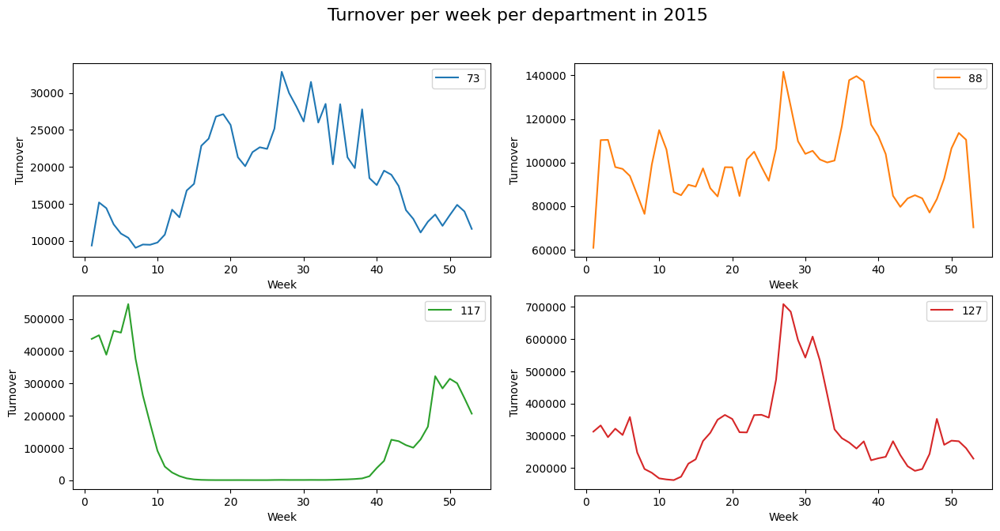

  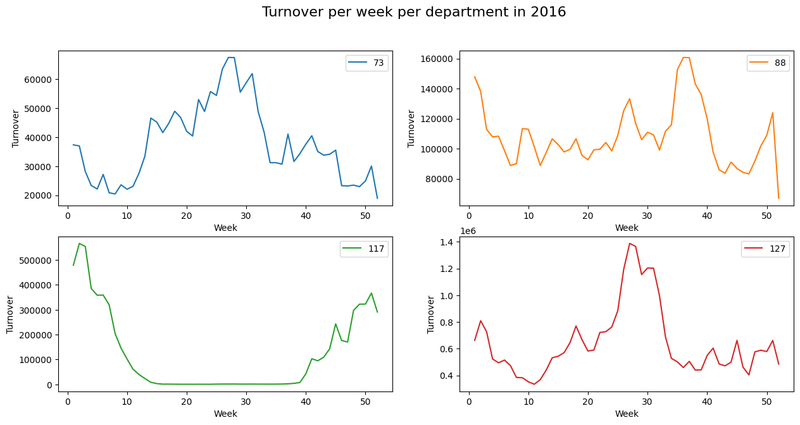

This shows us that in 2015 the top five weeks of department 88 are from top to bottom : 27,37,36,38,28.

These figures show that it seems that there is an important seasonality in the evolution of the turnover in function of the time.

### Top performers stores of 2014

The top performers stores of 2014 are from top to bottom : 121,17,118,189,100.

| Business Unit ID     | Location |
|:-------------:|:-------------:|
|121 | Close to Lyon|
|17|Montpellier|
|118|Villeneuve-d'Ascq|
|189|Paris 1|
|100|Close to Nantes|

It makes sense that these stores are the top performers in 2014 as they are located near or in big cities.

### What kind of sport is department 73

According to the plots of the annual evolution of turnover of department 73 for each years, it seems that department 73 might be an outdoor sport that is performed during summer, maybe something related to beach/water or good weather, as we can see during fall and winter the sales are dropping and in spring and summer the sales are going up.

### What kind of sport is department 117

According to the plots of the annual evolution of turnover of department 117 for each years, it seems that department 117 might be an sport that is performed during winter, maybe something related to skiing/snow, as we can see during fall and winter the sales are increasing and in spring and summer the sales are close to 0.

### A representation of business unit features

I decided to investigate what could represent the category but_region_idr_region and zod_idr_zone_dgr given for a business unit.
Thus I created these figures representing the geographical position of the store and their region category (color).

  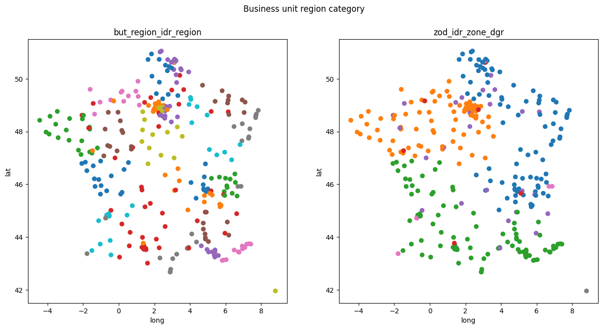

Looking at these figures I understand that the category correspond to a geographical position but also to something else (as some stores belongs to the same category and are far from each others).

###  An overall vue on data

After this data analysis I realized that to predict the turnover for the next 8 weeks it might be important to consider:
  * the department (as some department refers to winter/summer sports, each department has a different average behaviour on a year)
  * the location of the store using latitude, longitude, zod_idr_zone_dgr, but_region_idr_region as some stores might sells more than others in general (if they are close to big cities) and also some stores might sells than others more depending on the season(if they are close to the mountain and if it is winter season).
  * the period of the year as data seems to have a seasonal behaviour.
  * the actual trend of the last weeks (last 16 weeks for example) as the evolution of the turnover on a year still differs a bit of the average annual turnover.

## Modeling

### Firsts models

At the begining I tried different models based on this architecture idea :

  

The input consist of a differentiated timeserie of the last 16 weeks.
The main idea was to encode with a full connected layer the period of the year, the department and location of the store in an encoded feature vector.
Once each of this feature vector was encoded each element of the input was concatenated with this feature vector. The resulting sequence was fed to a LSTM followed by a full connected layer. The output was a sequence of predicted turnover.

This methods turned out to predict pretty poorly, I tried many ways to encode the feature vector, and I even deleted the feature vector to make prediction only based on the differentiated time series. The results were not that bad but not very interesting to make a real decision.

### Final Model Architecture

I figured out that my encoder was probably too weak to learn from the data and that I needed to switch strategy. Thus I firstly decided to split the predictors between each department, so each department will have its own predictor.
Then to continue with the idea that the period of the year was an important aspect, I decided to compute a timeserie of the average annual turnover over a year that will be used as a base by my neural network.
Finally I decided to use 4 k-nearest neighbors models (one per department) to predict the timeserie of the average annual turnover for a given department and a given position vector (latitude, longitude, region category).
This resulted in the following architecture :

  

  

As an example : we want to predict turnovers from week 17 to week 24 with X the turnovers from week 1 to 16 for a given store S and a given department D.
At first a position vector of the store S (latitude, longitude, region category) feeds a k-nearest neighbor model that is trained with data (based on years 2013,2014,2015,2016) related to department D. This k-nearest neighbor model outputs a 128-sized timeserie annual_s that represents the average turnover evolution over a year for this business unit and department.
This annual_s is sliced to take the data corresponding from weeks 1 to 24, this slice is interpolated and scaled to X.
X and the scaled slice are normalized(min max norm) by the maximum and minimum turnovers ever made in this department and store, this is done to penalize the network when its output is far from the reality relatively to the maximum of money ever made.
The scaled slice normalized will be called normalized support.
Normalized X and support are fed to one of the 4 LSTM module (one per department) that will predicts the normalized turnover from week 17 to 24.
The output of the LSTM will be un-normed by the maximum and minimum turnovers ever made in this department and store to obtain the turnover prediction.

The k-nearest neighbor models is based on a custom weighted distance function that compares distance between features vector :

$$ D(X,Y,w)=(X_{lat,long}-Y_{lat,long})^{2}+w_{0}*(X_{zod\_encoded}-Y_{zod\_encoded})^{2}+w_{1}*(X_{idr\_encoded}-Y_{idr\_encoded})^{2}+w_{3}$$

## Datasets
To train this model multiple datasets has been computed.
The datasets are implemented in the <a href="./dataset/dataset.py" target="_blank">dataset.py</a> file.

2 Annual_construction_dataset (training and validation) have been created to train and evaluate the k-nn models (and to tune their hyperparameters). These datasets are saved in <a href="data_annual_train.json" target="_blank">data_annual_train.json</a> and in <a href="data_annual_val.json" target="_blank">data_annual_val.json</a>.

2 Turnover_dataset (training and validation) have been created to train evaluate the LSTM modules. These datasets are saved in <a href="train_data.json" target="_blank">train_data.json</a> and in <a href="val_data.json" target="_blank">val_data.json</a>.

To split between training and validation for both dataset I decided to split the data with a date : January 2 2016.
The dataset has been computed using <a href="dataset_building.ipynb" target="_blank">dataset_building.ipynb</a>

## Training

### KNN
I firstly trained the k-nearest neighbor, the goal was to choose for each department hyperparameters to obtain the best validation loss. For the loss function I chose cosine loss as our objective is to predict a timeserie support that match with our data X. The hyperparameters here were the number of neighbors to use and the vector w to use in the distance calculation. As this is a really slow process I did not have the time to evaluate on a large set of hyperparameters, yet I obtained pretty good results with this training. The hyperparameters can be found in <a href="./dataset/predset.py" target="_blank">PredSet class definition</a> as knn_params attribute.
This training has been done using <a href="annual_curve_model_training.ipynb" target="_blank">annual_curve_model_training.ipynb</a>

### LSTM module
Then I trained the LSTM module. The chosen model is a <a href="./model/lstm.py" target="_blank">LSTM_Turnover</a> model with a hidden state size of 64 and 4 layers(~100k parameters).

I trained it with different process : the loss function used for training is a L1 lossfunction that compares the prediction with the ground truth. In order to force the network to output correct values even before that it is usefull (for week 15 as an example) it is possible to consider a "warmup" parameter. More over the training can either train the network to predict the value for week W and compares it to ground truth or train in to predict the sequence from week W to week W+7, this parameter is called future_pred in our training. This means that if the aim is to predict turnovers Y from week W to week W+7 with X which are turnovers value from week W-16 to W-1, the loss function used to compare prediction Y and ground truth Yt can be considered as:

$$Loss(Y,Yt)=L1Loss(Prediction_{week(W-warmup)\_to\_week(W+future\_pred-1)},Yt_{week(W-warmup)\_to\_week(W+future\_pred-1)})$$

The training is done using the training function described in <a href="./training/training.py" target="_blank">training.py</a>.
I trained each network for each derpartment with warmup = 0 or 8 and future_pred = 1 or 8. 
I used an adam Optimizer with learning rate set to 3e-4 and a learning rate scheduler that multiplies learning rate by 0.1 every 5 epochs. I trained for 15 epochs.

<a href="model_training.ipynb" target="_blank">model_training.ipynb</a>

For each network I computed the distribution of the loss for each element of the training/validation set. The results can be found in /media/eval folder each image name correspond to "(department)\_(warmup)\_(future_pred).png"
Here are some of them :

  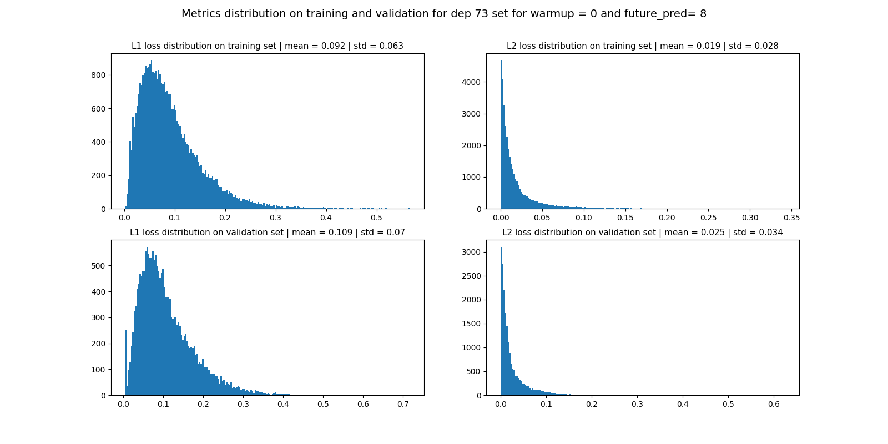

  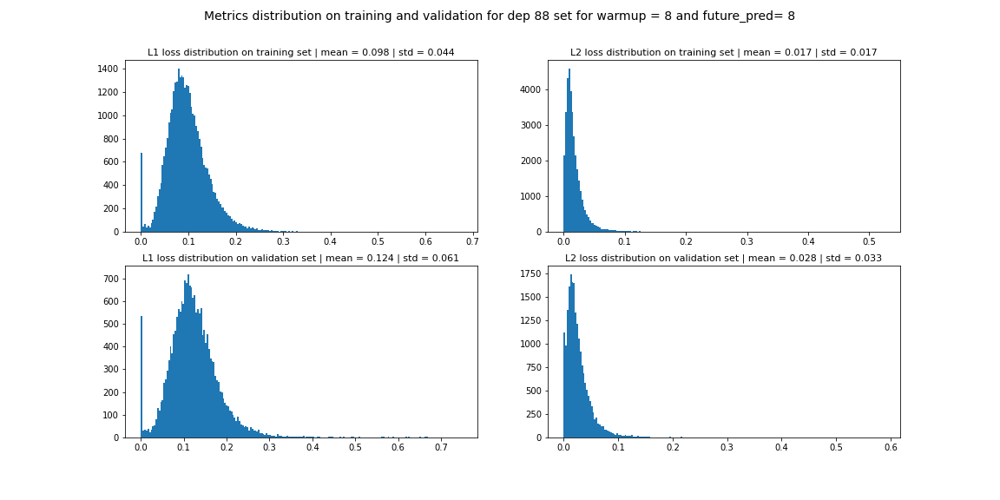

  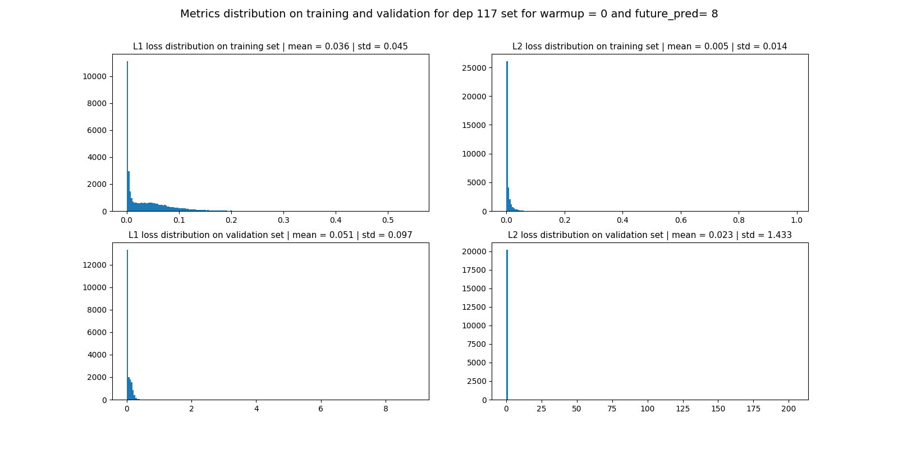

  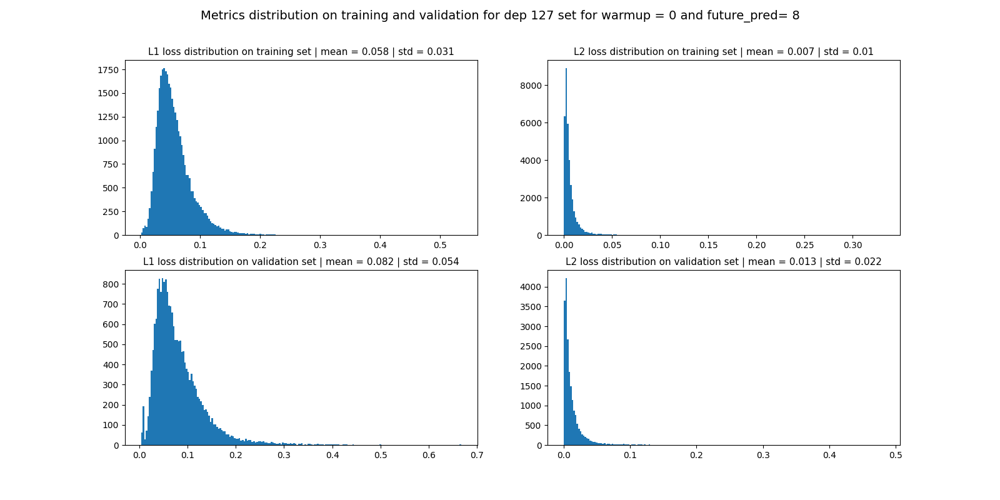

Based on these results I selected the weights for each department network.
As we can see the "worst" average error is for department 88 and is about 0.1 (normalized by maximum and minimum turnover ever made by the department of a given store) which is quite correct.

## Pipeline
Once the model trained, I implemented the pipeline which reads data from csv files, preprocess the data, loads the models, predicts the turnovers for the next 8 weeks and writes the prediction to a csv file.
The pipeline is implemented in <a href="./dataset/predset.py" target="_blank">predset.py</a>,<a href="./dataset/testdataset.py" target="_blank">testdataset.py</a>,<a href="./model/modelset.py" target="_blank">modelset.py</a>.

Commons issues involved in the deployment of machine learning model can be memory/hardware required or time needed to do a prediction, but here our pipeline produces results in 1 minute which is quite correct.
One other issue is that the kind of model that I implemented is based on training and does not adapt over the time, as it is based on data between 2013 and 2017, it might have difficulties to predict on data provided in 10 years as tendances might have changed. Also this models is defined for department 73,88,117 and 127 and might have difficulties to predict for other department. However I believe that the k-nn models with an input based on store location might help to predict for same department on a new store.

To monitor the perfomance of the model overtime it could be possible to compute the loss of the prediction overtime (every week compute the loss for prediction made 8 weeks before with the ground truth of the last 8 weeks).

## Using the pipeline

We would like to predict the turnovers of weeks W to W+7 
To use the pipeline you will need :

- A csv file named past_data.csv containing columns : ["day_id"],["but_num_business_unit"],["dpt_num_department"],["turnover"]. This datafile must contains at least 16 weeks of data before the week W of prediction (from W-16weeks to W-1weeks) for all business unit and department id in pred_df.csv.
- A csv file named pred_data.csv containing columns : ["day_id"],["but_num_business_unit"],["dpt_num_department"]. This datafile must must contains 7 weeks of data after the week W of prediction (from W to W+7weeks) for all business unit and department id for which the prediction will be done.
- A csv file named bu_feat.csv containing columns : ["but_num_business_unit"],["but_latitude"],["but_longitude"],["but_region_idr_region"],["zod_idr_zone_dgr"], it must contains data for all business unit and department id in pred_df.
- The json file data_knn.json that contains data for our knn-models.

1. Put your 4 files in the folder data.
2. Run "python makeprediction.py --dataroot --device --bu --dep --plot"
- dataroot is the root to your data folder (default "./data")
- device : 0 for cpu | 1 for gpu (default 0)
- bu : business unit number for which you will plot the prediction (default 95)
- dep : department number for which you will plot the prediction (default 73)
- plot : plot the prediction for a given bu and dep (yes = 1 | no = 0) (default 0)
3. Visualize you plot if you asked to
4. The predictions for all your departments & business unit is in data/results.csv on the same format as past_data.csv.

## Improve the model

Firstly given the short time that I had I was not able to tune the hyperparameters of my model a lot, and I believe that the performance could be improved by tuning it. Also one interesting thing could be to try to use more evolved timeserie analysis models as transformers which performs really well on NLP.
